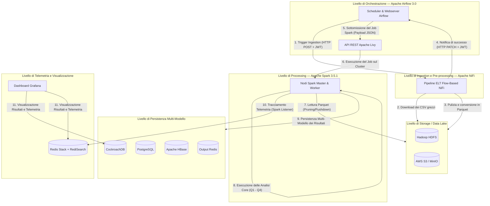
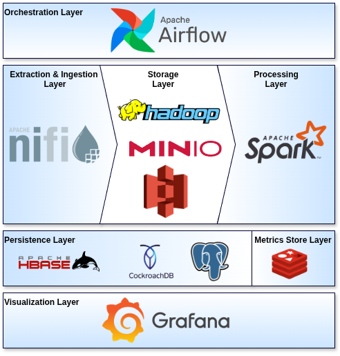
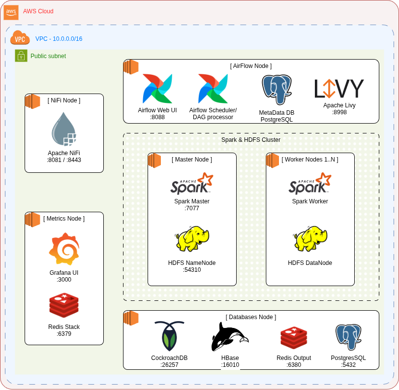

# Sky Analytics Engine (SAE)

> **Systems and Architectures for Big Data [SABD]** — *Università degli Studi di Roma "Tor Vergata"*
> Una Pipeline Batch Distribuita, Decoupled e Multi-Cloud per l'Analisi delle Performance dei Voli Domestici negli Stati Uniti (Gen–Apr 2025).

<p align="center">
  
  
  
  
  
  
  
  
  
</p>

## Panoramica del Progetto
**Sky Analytics Engine (SAE)** è una piattaforma distribuita di elaborazione Big Data altamente modulare, resiliente e "cloud-ready", progettata per l'acquisizione, la pulizia, l'analisi e la visualizzazione di massivi dataset del settore aeronautico.

Focalizzandosi sui dati storici dei voli commerciali negli Stati Uniti nel quadrimestre **Gennaio–Aprile 2025** (forniti dal Bureau of Transportation Statistics), il progetto valuta e confronta le performance di diverse astrazioni di calcolo distribuito in Apache Spark (**RDD** vs. **Dataframe** vs. **Spark SQL**) ed analizza l'efficienza infrastrutturale sia su reti multi-nodo di istanze virtuali standalone (**AWS EC2**) sia su ambienti elastic managed cloud-native (**AWS EMR**).


## Architettura del Sistema
Il sistema evita completamente l'approccio monolitico, configurandosi come un'aggregazione di servizi distribuiti coordinati che comunicano esclusivamente attraverso interfacce e API standardizzate.



### Livelli Architetturali e Meccanismi di Disaccoppiamento



| Livello             | Tecnologia                         | Caratteristiche Chiave e Strategia di Disaccoppiamento                                                                                                                                                                                                                                                                                                                            |
| :--------------------| :-----------------------------------| :----------------------------------------------------------------------------------------------------------------------------------------------------------------------------------------------------------------------------------------------------------------------------------------------------------------------------------------------------------------------------------|
| **Orchestrazione**  | **Apache Airflow 3.0**             | Sfrutta la moderna TaskFlow API. Elimina la necessità di installare i binari locali di Spark/Hadoop sui nodi worker di Airflow interagendo esclusivamente con le **API REST di Apache Livy** (configurando Spark come risorsa *Compute-as-a-Service*).                                                                                                                            |
| **Ingestion**       | **Apache NiFi**                    | Implementa il paradigma Flow-Based Programming. Airflow avvia il flusso NiFi tramite una chiamata HTTP POST fornendo un JWT generato a runtime. NiFi esegue decompressione, validazione hash SHA-1, pulizia e conversione colonnare. Al termine, NiFi aggiorna lo stato di Airflow asincronamente tramite una **callback HTTP PATCH**, riducendo al minimo il polling di risorse. |
| **Storage**         | **HDFS / AWS S3**                  | Funge da *Single Source of Truth* (**Data Lake**), ospitando sia i CSV grezzi sia i dati preprocessati. Questi ultimi vengono convertiti nel formato fortemente tipizzato **Parquet**, abilitando ottimizzazioni avanzate di Spark come il *predicate pushdown* e la *column projection*, con una drastica riduzione dell'I/O di rete.                                            |
| **Processing**      | **Apache Spark 3.5.1**             | Sviluppato in Java applicando i design pattern GoF **Factory** e **Repository** (`FlightRepositoryFactory`). Consente alla logica analitica di business di rimanere identica indipendentemente dal database o dallo storage target, iniettando le configurazioni tramite file YAML specifici per ogni ambiente.                                                                   |
| **Persistenza**     | **CockroachDB / Postgres / HBase** | Persistenza multi-modello dei risultati. **CockroachDB** garantisce consistenza distribuita e compatibilità con PostgreSQL per cluster cloud; **PostgreSQL** funge da alternativa locale leggera per lo sviluppo; **Apache HBase** abilita un paradigma NoSQL wide-column per letture sub-millisecondo su grandi volumi.                                                          |
| **Telemetria**      | **Redis Stack + RediSearch**       | Memorizza la telemetria applicativa distribuita emessa in tempo reale tramite un listener personalizzato (`JobTimerListener`), che estende lo `SparkListener` nativo per separare il tempo puro di computazione JVM dalle latenze di negoziazione delle risorse ed allocazione dei container.                                                                                     |
| **Visualizzazione** | **Grafana**                        | Fornisce dashboard interattive che interrogano CockroachDB (per i risultati di business) e Redis Stack (per la telemetria tecnica tramite RediSearch), consentendo di correlare visivamente i tempi di calcolo hardware con i risultati analitici.                                                                                                                                |


## Query Analitiche Core e Caratteristiche
Ogni classe analitica estende la classe astratta `BaseQuery` (che gestisce l'inizializzazione della `SparkSession`, il logging strutturato, l'iniezione del listener e il recupero dei dati dal repository) e implementa le tre astrazioni di Spark RDD, DataFrame e SQL:

### Query 1: Statistiche Mensili delle Performance (`MonthlyPerformanceAnalyzer`)
* **Obiettivo:** Calcola le statistiche mensili (media, min, max del ritardo in partenza, tasso di cancellazione) per specifiche compagnie aeree.
* **Ottimizzazione RDD:** Evita l'operatore bloccante `groupByKey` che causerebbe pesanti colli di bottiglia durante lo shuffle di rete. Al suo posto, utilizza la **Map-Side Aggregation** tramite `aggregateByKey`, combinando parzialmente i record all'interno delle singole partizioni dei worker prima del trasferimento. Viene impiegato un accumulatore compatto in formato array:
  $$\mathcal{A}_{Q1} = \langle \textstyle \sum D_{dep}, \max(D_{dep}), \min(D_{dep}), N_{validi}, N_{totali} \rangle$$
  che unisce localmente i record prima del trasferimento, riducendo drasticamente lo shuffle.

### Query 2: Decomposizione e Classifica dei Ritardi (`ArrivalDelayRanking`)
* **Obiettivo:** Ranks delle top 10 compagnie con maggior ritardo all'arrivo e ne decompone le cause (ritardo dovuto a Vettore, Meteo, NAS, Sicurezza, Ritardo Propagato).
* **Gestione Dati Sparsi (Data Quality):** Per legge federale, le compagnie non sono tenute a specificare le cause dettagliate per ritardi all'arrivo inferiori a 15 minuti. Questo genera milioni di valori nulli. SAE implementa una **strategia di imputazione a zero** (combinando il pre-processing degli script in NiFi e l'uso di `coalesce` in Spark) per distinguere tra *Analisi dell'Intensità* (calcolata solo sui voli effettivamente in ritardo, che sovrastimerebbe il problema) e *Analisi del Contributo Medio* (calcolata su tutti i voli validi, consentendo una visione realistica della resilienza del business).

### Query 3: Percentili per Fasce Orarie (`HourlyDelayPercentiles`)
* **Obiettivo:** Calcola i percentili di ritardo (mediana, 90° percentile, ecc.) per compagnia suddivisi in finestre orarie di 2 ore.
* **Quantile Sketching:** Il calcolo esatto richiede l'ordinamento globale di milioni di record, un'operazione che in ambiente distribuito satura la rete e la memoria. SAE risolve questo problema integrando la libreria **Apache DataSketches** per implementare l'algoritmo **Karnin-Lang-Liberty (KLL)** (e in alternativa **T-Digest**), configurabili a runtime tramite la proprietà `percentileAlgorithm` in `ApplicationConfig`.
* Grazie alla proprietà di *unione* degli sketch, i buffer binari generati sui worker vengono fusi sul nodo driver con complessità spaziale fissa $O(1)$ indipendente dalla dimensione dei dati, garantendo un errore massimo di rango di appena $\sim 1.6\%$.

### Query 4: Clustering delle Compagnie Aeree (`AirlineClustering`)
* **Obiettivo:** Raggruppa le compagnie aeree in base alle loro feature prestazionali ed operative.
* **Machine Learning Pipeline:** Implementata esclusivamente tramite le API DataFrame per sfruttare le funzionalità ottimizzate di Spark MLlib. La pipeline consolida le colonne numeriche in un unico vettore (`VectorAssembler`) e applica una normalizzazione Z-score (`StandardScaler`) per evitare che feature con magnitudo maggiore dominino la distanza euclidea del K-Means.
* **Selezione Automatica del Modello:** Il sistema esegue un ciclo iterativo addestrando modelli da $K=2$ a $K=8$ e valuta la qualità statistica dei cluster tramite il **Silhouette Score** (coesione interna vs separazione esterna), selezionando dinamicamente il $K$ ottimale (trovato a $K=3$).

> [!NOTE]
> **I Tre Cluster Identificati ($K=3$):**
> * **Cluster 0 (Inefficienza Operativa e Propagazione):** Comprende compagnie come `AA`, `F9`, `OH`. Presentano ritardi all'arrivo molto elevati guidati da un forte effetto di propagazione a catena (*late aircraft delay*), con tassi di cancellazione critici superiori al $6\%$.
> * **Cluster 1 (Sensibilità Esterna e "Volo a tutti i costi"):** Formato unicamente da Allegiant Air (`G4`). Subisce ritardi elevati per fattori meteorologici o di sicurezza ma registra un tasso di cancellazioni bassissimo ($0.6\%$), denotando una politica aziendale orientata a completare i voli programmati indipendentemente dalle avversità.
> * **Cluster 2 (Alta Efficienza e Stabilità):** Il gruppo più virtuoso (Delta `DL`, United `UA`, SkyWest `YX`). Ritardi all'arrivo minimi (es. `YX` con una media di $0.69$ minuti) ed eccellente capacità di recuperare tempo in volo rispetto alla schedulazione originaria (*delay makeup* nettamente negativo).


## Insight Prestazionali (Dalla Relazione `docs/report`)
Sulla base del benchmark sistematico condotto nella relazione del progetto, sono stati evidenziati alcuni importanti trade-off relativi all'elaborazione distribuita:

### ⚙️ Ottimizzazione Catalyst & Tungsten Engine
Le API strutturate (DataFrame/SQL) presentano box plot prestazionali molto contratti e stabili rispetto ad RDD.
* **Catalyst** genera piani fisici ottimizzati compilando codice Java a runtime.
* **Tungsten** memorizza i dati off-heap in formato binario compresso, aggirando l'allocazione di oggetti sulla JVM. Ciò riduce a livelli trascurabili l'attività di Garbage Collection, neutralizzando una delle fonti principali di variabilità temporale nei sistemi distribuiti.
* Al contrario, il backend RDD passa oggetti generici che caricano pesantemente lo heap della JVM, innescando frequenti cicli di garbage collection che ampliano la dispersione statistica.

### Efficienza RDD Core su AWS EC2
In specifiche computazioni fortemente atomiche o non lineari (es. Query 2 e 3 su EC2), il **backend RDD ha registrato tempi di calcolo core inferiori** rispetto alle controparti DataFrame/SQL. Questo si deve al minor overhead di astrazione dell'API RDD. Quando una query non beneficia delle ottimizzazioni relazionali di Catalyst, le API strutturate introducono lievi latenze dovute all'ispezione ricorsiva dei metadati dei file Parquet.

### Partition Pruning vs. Predicate Pushdown
SAE ha confrontato le due principali strategie per l'ottimizzazione dell'I/O:
* **Partition Pruning:** Spark esclude a monte le partizioni non necessarie direttamente a livello di file system, evitando del tutto l'apertura e la scansione dei file irrilevanti. Questo abbatte i byte letti e garantisce un bilanciamento del carico tra i nodi worker ottimale (**Executor Workload Skewness** piatta).
* **Predicate Pushdown:** Spark deve comunque accedere ai file Parquet per ispezionarne i metadati nei footer. Questo genera un volume di lettura fisicamente molto più elevato sull'infrastruttura di storage e introduce un forte sbilanciamento del carico, portando un singolo worker a farsi carico della quasi totalità della scansione iniziale.


## Modalità di Deployment e Requisiti

### Requisiti di Sistema
* **Docker & Docker Compose** (versione 2.20+)
* **Java Development Kit (JDK) 17**
* **Apache Maven 3.8+**
* **AWS CLI** (per configurazioni cloud)
* *Raccomandazione hardware:* Almeno **16 GB RAM** per supportare l'avvio locale dello stack multi-container.


### Modalità 1: Sviluppo Locale Containerizzato (Docker Compose)
Questa modalità avvia l'intero stack distribuito all'interno di una rete virtuale bridge locale (`sae-net`), replicando un ambiente multi-nodo reale su una singola macchina.

#### 1. Configura l'Ambiente
Copia il file di configurazione d'esempio ed eventualmente personalizza le variabili:
```bash
cp .env.example .env
```

#### 3. Avvia lo Stack Multi-Container
Lancia tutti i servizi in background:
```bash
docker compose up -d
```
Vengono avviati i seguenti servizi:
* **Ingestion:** Apache NiFi (porte `8081` http, `8443` https, `8085` Site-to-Site)
* **Storage:** HDFS NameNode (`9870`), 2x HDFS DataNodes, MinIO S3 Emulator (`9000`, `9001`)
* **Processing:** Spark Master (`8080`, `7077`, `4040`), 3x Spark Workers, Apache Livy REST API (`8998`)
* **Persistence:** PostgreSQL (`5432`), CockroachDB (`26257`, `8082`), HBase (`16010` UI, `2181` ZK), Redis Output (`6380`)
* **Orchestration:** Airflow Webserver/Scheduler (`8088`)
* **Metrics & Monitoring:** Redis Stack Telemetry (`6379`, `8001`), Grafana Dashboard (`3000`)

#### 4. Compila l'Applicazione Spark
Compila il codice Java tramite Maven per generare il fat-JAR:
```bash
cd spark
mvn clean package
cd ..
```
Il JAR compilato sarà disponibile in `spark/target/flight-analysis.jar`.

#### 5. Carica il file JAR su HDFS
L'operatore Airflow si aspetta che il JAR di Spark risieda nel file system distribuito. Copia il JAR sul NameNode e caricalo nella cartella `/bin` di HDFS:
```bash
# Copia il JAR nel container HDFS NameNode
docker cp spark/target/flight-analysis.jar hdfs-master:/tmp/

# Esegui il caricamento in HDFS
docker exec -it hdfs-master /usr/local/hadoop/bin/hdfs dfs -put -f /tmp/flight-analysis.jar /bin/flight-analysis.jar
```

#### 6. Avvia il DAG o Submit Manuale
* **Interfaccia Web di Airflow:** Apri `http://localhost:8088` (credenziali: `admin`/`admin_password`), attiva il DAG `flight_analysis` ed esegui un trigger manuale configurando i parametri a piacere.
* **CLI Spark Submit locale:** Esegui direttamente il job all'interno del container Spark Master tramite il nostro script helper:
  ```bash
  ./deploy/scripts/spark-submit.sh monthly_performance dataframe
  ```

### Modalità 2: Cluster Multi-Nodo su AWS EC2 (VM Standalone)


Distribuisce le singole componenti logiche dell'architettura su istanze Amazon EC2 dedicate all'interno di una Virtual Private Cloud (VPC) privata, tramite AWS CloudFormation.

1. **Inizializzazione della Rete:** Crea VPC, subnet pubbliche/private, security group e DNS privato tramite CloudFormation:
   ```bash
   cd deploy
   ./deploy-network.sh
   ```
2. **Provisioning dei Nodi del Cluster:** Crea le singole istanze EC2 (1x Master `t3.small` per HDFS/Spark, Nx Workers `t3.small`, Airflow Node `t3.medium`, NiFi Node `t3.small`, Metrics Node `t3.small`, Database Node `t3.small`) ed effettua l'associazione DNS Route53 privata e lo scambio delle chiavi SSH:
   ```bash
   ./deploy-node.sh all
   ```
3. **Sincronizzazione degli Asset su S3:** Crea il bucket S3 e sincronizza i DAG di Airflow, i flussi NiFi, i file di configurazione e il JAR compilato:
   ```bash
   ./init-bucket.sh
   ```

### Modalità 3: Deployment Cloud-Native su AWS EMR (Cluster Gestito)
Configura un cluster elastico gestito Amazon Elastic MapReduce per l'elaborazione dei dati a livello enterprise, sfruttando il gestore di risorse Hadoop YARN e lo storage S3.

1. **Distribuzione dello Stack EMR:** Lancia il cluster gestito EMR composto da 1x master node e 3x core worker nodes di tipo `m6g.xlarge` tramite CloudFormation:
   ```bash
   cd deploy
   ./deploy-spark.sh
   ```
2. **Esecuzione tramite Airflow:** Il DAG `emr_benchmark.py` interagisce direttamente con i servizi AWS tramite gli operatori nativi `EmrAddStepsOperator` e `EmrStepSensor` per iniettare i job Spark come step sequenziali nel cluster EMR.
3. **Paradigma Shared-Nothing:** Lo storage è completamente disaccoppiato tramite il protocollo `s3a://`. Le risorse di calcolo vengono allocate e spente on-demand al completamento dei job, azzerando i costi di idle.


## Visualizzazione dei Risultati
Una volta completata la pipeline, accedi a Grafana all'indirizzo `http://localhost:3000` (credenziali: `admin`/`admin`). Le dashboard caricate in automatico includono:
* **Business Dashboard:** Andamenti mensili dei ritardi, percentuali di contribuzione delle cause, percentili orari e il diagramma bidimensionale del clustering K-Means tramite PCA.
* **Technical Dashboard:** Tempi di calcolo medi e mediani, dimensioni dello shuffle write, tempi di cpu degli executor e overhead di Garbage Collection per confrontare le performance di RDD, DataFrame e SQL su EC2 ed EMR.


## Autori
* **Flavio Simonelli** - *Sistemi e Architetture per Big Data [SABD]*
  **Università degli Studi di Roma "Tor Vergata"** (A.A. 2025/2026)

* **Francesco Masci** - *Sistemi e Architetture per Big Data [SABD]* **Università degli Studi di Roma "Tor Vergata"** (A.A. 2025/2026)