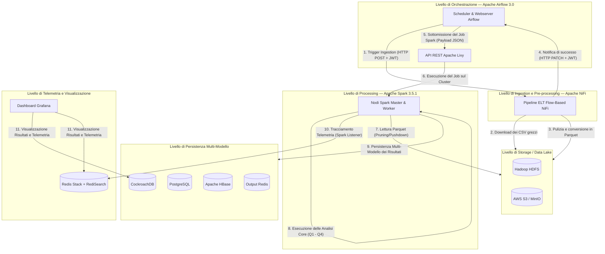

# Sky Analytics Engine (SAE)
> **Systems and Architectures for Big Data [SABD]** — *Università degli Studi di Roma "Tor Vergata"*
> Una Pipeline Batch Distribuita, Decoupled e Multi-Cloud per l'Analisi delle Performance dei Voli Domestici negli Stati Uniti (Gen–Apr 2025).

---

<p align="center">
  
  
  
  
  
  
  
  
  
</p>

---

## Panoramica del Progetto
**Sky Analytics Engine (SAE)** è una piattaforma distribuita di elaborazione Big Data altamente modulare e "cloud-ready", progettata per l'acquisizione, la pulizia, l'analisi e la visualizzazione di massivi dataset aeronautici.

Focalizzandosi sui dati storici dei voli commerciali negli Stati Uniti nel quadrimestre **Gennaio–Aprile 2025** (Bureau of Transportation Statistics), il sistema consente di valutare e confrontare le performance delle diverse astrazioni di calcolo distribuito in Apache Spark (**RDD** vs. **Dataframe** vs. **Spark SQL**) ed analizzare l'efficienza infrastrutturale sia su reti multi-nodo standalone (**AWS EC2**) sia su ambienti elastic managed cloud-native (**AWS EMR**).

Applicando rigorosamente il principio della **Separation of Concerns**, la piattaforma isola logica computazionale e infrastruttura: dall'ingest strutturata tramite flussi operativi (Flow-Based) fino alla persistenza multi-modello dei risultati e al tracciamento in tempo reale della telemetria distribuita.

## Struttura delle Directory e dei File
La struttura del repository riflette coerentemente la modularità dell'architettura e la suddivisione delle responsabilità (Separation of Concerns). Di seguito viene dettagliato lo scopo di ciascuna cartella e dei file chiave:

```text
├── airflow/                   # Livello di Orchestrazione (Apache Airflow 3.0)
│   ├── dags/                  # Definizione dei flussi di lavoro (DAGs)
│   │   ├── ec2_benchmark.py   # DAG per benchmark sequenziale su istanze standalone/EC2
│   │   ├── emr_benchmark.py   # DAG per benchmark su cluster cloud-native AWS EMR
│   │   ├── flight_analysis.py # DAG di produzione principale (NiFi Ingestion -> Spark/Livy)
│   │   └── payload.json       # Template JSON utilizzato per configurare il flusso NiFi
│   ├── config/                # Configurazioni interne del servizio Airflow
│   └── Dockerfile             # Ricetta Docker per estendere l'immagine Airflow ufficiale
├── deploy/                    # Script di Deployment ed Automazione per Cluster VM Multi-Nodo
│   ├── compose/               # Docker-compose frammentati per servizi specifici
│   ├── configs/               # Configurazioni per il boot dei nodi del cluster
│   ├── envs/                  # Ambienti e profili infrastrutturali pre-caricati
│   ├── init/                  # Script di bootstrap per la configurazione dei nodi
│   ├── scripts/               # Script helper eseguiti sulle macchine (submit Spark, db-selector)
│   ├── template/              # Template AWS CloudFormation (cluster-vpc.yaml, cluster-node.yaml, spark-emr.yaml)
│   └── *.sh e *.bat           # Script di orchestrazione globale per rete, nodi e S3
├── docs/                      # Documentazione di Progetto (Report, Slide e Traccia)
│   ├── report/                # Relazione tecnica dettagliata
│   │   ├── relazione.tex      # Sorgente LaTeX della relazione
│   │   └── relazione.pdf      # PDF compilato della relazione tecnica del progetto (DOCUMENTAZIONE PRINCIPALE)
│   ├── Project1_presentation.pdf # Presentazione e slide del progetto big data
│   ├── SABD2526_Progetto1.pdf # Traccia ed requisiti ufficiali del progetto
│   └── charts/ graphs/ csv/   # Grafici, telemetria statistica ed output dei benchmark
├── grafana/                   # Configurazioni di provisioning per Grafana (dashboard e datasources)
├── hadoop/                    # File di configurazione per il cluster HDFS (core-site.xml, hdfs-site.xml)
├── livy/                      # Dockerfile e configurazioni per il middleware Apache Livy
├── nifi/                      # Estensioni custom e template di flusso per il livello di Ingestion
├── spark/                     # Codice Sorgente del Processing Layer (Progetto Java Maven)
│   ├── src/main/java/it/uniroma2/sae/  # Albero dei sorgenti Java
│   │   ├── config/            # Classi di caricamento e parsing YAML (.yml)
│   │   ├── factory/           # Implementazione del pattern GoF Factory (Repository Factory)
│   │   ├── query/             # Logica analitica distribuita delle 4 Query (Monthly, Delay, Percentiles, Clustering)
│   │   ├── repository/        # Astrazione del data-access layer (FlightRepository)
│   │   └── FlightAnalysisApp.java # Main entry point dell'applicazione Spark
│   ├── src/main/resources/    # File YAML di configurazione specifici (local, ec2, emr-config.yml)
│   └── pom.xml                # Configurazione di Maven ed elenco delle dipendenze esterne
├── docker-compose.yml         # File Docker Compose principale per l'ambiente locale
├── .env.example               # Template per le variabili d'ambiente necessarie allo stack
└── .gitignore                 # File esclusi dal versionamento git
```

> [!TIP]
> **Dove Trovare la Documentazione Tecnica?**
> La documentazione completa che descrive l'analisi matematica delle query, le valutazioni sperimentali, i grafici di telemetria e la giustificazione delle scelte algoritmiche (Quantile Sketching KLL/T-Digest, Z-Score Scaling, K-Means e Silhouette Score) si trova in [docs/report/relazione.pdf](file://docs/report/relazione.pdf). Le slide di presentazione del progetto sono invece caricate in //TODO.

## Architettura del Sistema
Il sistema evita completamente l'approccio monolitico, configurandosi come un'aggregazione di servizi distribuiti coordinati che comunicano esclusivamente attraverso interfacce e API standardizzate.



### Livelli Architetturali e Meccanismi di Disaccoppiamento

| Livello             | Tecnologia                         | Caratteristiche Chiave e Strategia di Disaccoppiamento                                                                                                                                                                                                                                                                                                                            |
| :--------------------| :-----------------------------------| :----------------------------------------------------------------------------------------------------------------------------------------------------------------------------------------------------------------------------------------------------------------------------------------------------------------------------------------------------------------------------------|
| **Orchestrazione**  | **Apache Airflow 3.0**             | Sfrutta la moderna TaskFlow API. Elimina la necessità di installare i binari locali di Spark/Hadoop sui nodi worker di Airflow interagendo esclusivamente con le **API REST di Apache Livy** (configurando Spark come risorsa *Compute-as-a-Service*).                                                                                                                            |
| **Ingestion**       | **Apache NiFi**                    | Implementa il paradigma Flow-Based Programming. Airflow avvia il flusso NiFi tramite una chiamata HTTP POST fornendo un JWT generato a runtime. NiFi esegue decompressione, validazione hash SHA-1, pulizia e conversione colonnare. Al termine, NiFi aggiorna lo stato di Airflow asincronamente tramite una **callback HTTP PATCH**, riducendo al minimo il polling di risorse. |
| **Storage**         | **HDFS / AWS S3**                  | Funge da *Single Source of Truth* (**Data Lake**), ospitando sia i CSV grezzi sia i dati preprocessati. Questi ultimi vengono convertiti nel formato fortemente tipizzato **Parquet**, abilitando ottimizzazioni avanzate di Spark come il *predicate pushdown* e la *column projection*, con una drastica riduzione dell'I/O di rete.                                            |
| **Processing**      | **Apache Spark 3.5.1**             | Sviluppato in Java applicando i design pattern GoF **Factory** e **Repository** (`FlightRepositoryFactory`). Consente alla logica analitica di business di rimanere identica indipendentemente dal database o dallo storage target, iniettando le configurazioni tramite file YAML specifici per ogni ambiente.                                                                   |
| **Persistenza**     | **CockroachDB / Postgres / HBase** | Persistenza multi-modello dei risultati. **CockroachDB** garantisce consistenza distribuita e compatibilità con PostgreSQL per cluster cloud; **PostgreSQL** funge da alternativa locale leggera per lo sviluppo; **Apache HBase** abilita un paradigma NoSQL wide-column per letture sub-millisecondo su grandi volumi.                                                          |
| **Telemetria**      | **Redis Stack + RediSearch**       | Memorizza la telemetria applicativa distribuita emessa in tempo reale tramite un listener personalizzato (`JobTimerListener`), che esende lo `SparkListener` nativo per separare il tempo puro di computazione JVM dalle latenze di negoziazione delle risorse ed allocazione dei container.                                                                                      |
| **Visualizzazione** | **Grafana**                        | Fornisce dashboard interattive che interrogano CockroachDB (per i risultati di business) e Redis Stack (per la telemetria tecnica tramite RediSearch), consentendo di correlare visivamente i tempi di calcolo hardware con i risultati analitici.                                                                                                                                |

## Modalità di Deployment e Requisiti

### Requisiti di Sistema
* **Docker & Docker Compose** (versione 2.20+)
* **Java Development Kit (JDK) 11**
* **Apache Maven 3.8+**
* **AWS CLI** (per configurazioni cloud)
* *Raccomandazione hardware:* Almeno **16 GB RAM** per supportare l'avvio locale dello stack multi-container.

---

### Modalità 1: Sviluppo Locale Containerizzato (Docker Compose)
Questa modalità avvia l'intero stack distribuito all'interno di una rete virtuale bridge locale (`sae-net`), replicando un ambiente multi-nodo reale su una singola macchina per scopi di sviluppo e test.

#### 1. Configura l'Ambiente
Copia il file di configurazione d'esempio ed eventualmente personalizza le credenziali:
```bash
cp .env.example .env
```

#### 2. Inizializza Airflow e le Cartelle
Esegui il container di inizializzazione per creare le cartelle locali con permessi adeguati, migrare il database dei metadati di Airflow e configurare l'utente amministratore predefinito:
```bash
docker compose up airflow-init
```

#### 3. Avvia lo Stack Multi-Container
Lancia tutti i servizi in background tramite docker-compose:
```bash
docker compose up -d
```
Questo comando avvia i seguenti servizi pronti all'uso:
* **Ingestion:** Apache NiFi (porte `8081` http, `8443` https, `8085` Site-to-Site)
* **Storage:** HDFS NameNode (`9870`), 2x HDFS DataNodes, MinIO S3 Emulator (`9000`, `9001`)
* **Processing:** Spark Master (`8080`, `7077`, `4040`), 3x Spark Workers, Apache Livy REST API (`8998`)
* **Persistenza:** PostgreSQL (`5432`), CockroachDB (`26257`, `8082`), HBase (`16010` UI, `2181` ZK), Redis Output (`6380`)
* **Orchestration:** Airflow Webserver/Scheduler (`8088`)
* **Metrics & Monitoring:** Redis Stack Telemetry (`6379`, `8001`), Grafana Dashboard (`3000`)

#### 4. Compila l'Applicazione Spark
Naviga nella cartella `spark` e compila il codice Java tramite Maven per generare il fat-JAR dell'applicazione:
```bash
cd spark
mvn clean package
cd ..
```
Il JAR compilato sarà salvato in `spark/target/flight-analysis.jar`.

#### 5. Carica il file JAR su HDFS
L'operatore Airflow si aspetta che il JAR di Spark risieda nel file system distribuito. Copia il JAR sul NameNode e caricalo nella cartella `/bin` di HDFS:
```bash
# Copia il JAR nel container HDFS NameNode
docker cp spark/target/flight-analysis.jar hdfs-master:/tmp/

# Esegui il caricamento in HDFS
docker exec -it hdfs-master /usr/local/hadoop/bin/hdfs dfs -put -f /tmp/flight-analysis.jar /bin/flight-analysis.jar
```

#### 6. Esecuzione della Pipeline
* **Interfaccia Web di Airflow:** Apri `http://localhost:8088` (credenziali: `admin`/`admin_password`), attiva il DAG `flight_analysis` ed esegui un trigger manuale per lanciare la pipeline completa (NiFi Ingest + Spark Processing via Livy).
* **CLI Spark Submit locale:** Esegui direttamente il job all'interno del container Spark Master tramite lo script helper locale:
  ```bash
  ./deploy/scripts/spark-submit.sh monthly_performance dataframe
  ```

---

### Modalità 2: Cluster Multi-Nodo su AWS EC2 (VM Standalone)
Distribuisce le singole componenti logiche dell'architettura su istanze Amazon EC2 dedicate all'interno di una Virtual Private Cloud (VPC) privata, tramite AWS CloudFormation ed automazione Bash.

1. **Inizializzazione della Rete:** Crea VPC, subnet pubbliche/private, internet gateways, tabelle di routing e security group specifici tramite CloudFormation:
   ```bash
   cd deploy
   ./deploy-network.sh
   ```
2. **Provisioning dei Nodi del Cluster:** Crea le singole istanze EC2 (1x Master `t3.small` per HDFS/Spark, Nx Workers `t3.small`, Airflow Node `t3.medium`, NiFi Node `t3.small`, Metrics Node `t3.small`, Database Node `t3.small`) ed effettua l'associazione DNS Route53 privata e lo scambio delle chiavi crittografiche SSH per la comunicazione interna:
   ```bash
   ./deploy-node.sh all
   ```
3. **Sincronizzazione degli Asset su S3:** Crea il bucket S3 e sincronizza i DAG di Airflow, i flussi NiFi, i file di configurazione e il JAR compilato per renderli disponibili al cluster:
   ```bash
   ./init-bucket.sh
   ```

---

### Modalità 3: Deployment Cloud-Native su AWS EMR (Cluster Gestito)
Configura un cluster elastico gestito Amazon Elastic MapReduce per l'elaborazione dei dati a livello enterprise, sfruttando il gestore di risorse Hadoop YARN e lo storage S3.

1. **Distribuzione dello Stack EMR:** Lancia il cluster gestito EMR composto da 1x master node e 3x core worker nodes di tipo `m6g.xlarge` tramite CloudFormation:
   ```bash
   cd deploy
   ./deploy-spark.sh
   ```
2. **Esecuzione tramite Airflow:** Il DAG `emr_benchmark.py` interagisce direttamente con i servizi AWS tramite gli operatori nativi `EmrAddStepsOperator` e `EmrStepSensor` per iniettare i job Spark come step sequenziali nel cluster EMR.
3. **Paradigma Shared-Nothing:** Lo storage è completamente disaccoppiato tramite il protocollo `s3a://`. Le risorse di calcolo vengono allocate e spente on-demand al completamento dei job, azzerando i costi di idle.

---

## Visualizzazione dei Risultati
Una volta completata la pipeline, accedi a Grafana all'indirizzo `http://localhost:3000` (credenziali: `admin`/`admin`). Le dashboard caricate in automatico includono:
* **Business Dashboard:** Andamenti mensili dei ritardi, percentuali di contribuzione delle cause, percentili orari e il diagramma bidimensionale del clustering K-Means tramite PCA.
* **Technical Dashboard:** Tempi di calcolo medi e mediani, dimensioni dello shuffle write, tempi di cpu degli executor e overhead di Garbage Collection per confrontare le performance di RDD, DataFrame e SQL su EC2 ed EMR.

---

## Autori
* **Flavio Simonelli** - *Sistemi e Architetture per Big Data [SABD]*
  **Università degli Studi di Roma "Tor Vergata"** (A.A. 2025/2026)

* **Francesco Masci** - *Sistemi e Architetture per Big Data [SABD]* **Università degli Studi di Roma "Tor Vergata"** (A.A. 2025/2026)